# ⚔️ Attack Scenarios

## 🔴 SSH Brute Force

### Command Used:
ssh kali@target-ip

### Detection:
- Rule ID: 5763
- Multiple failed login attempts detected

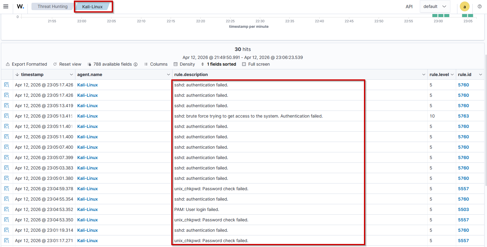

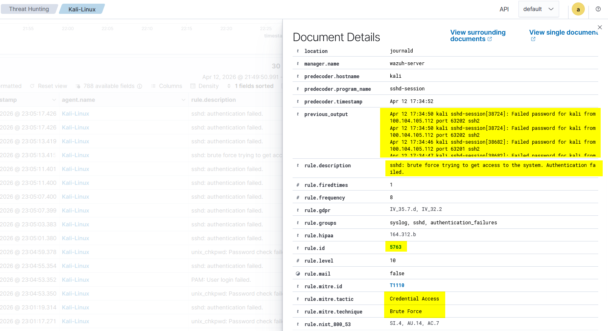

---

## 🟢 Successful Login

### Detection:
- Rule ID: 5715, 5901
- Authentication success observed
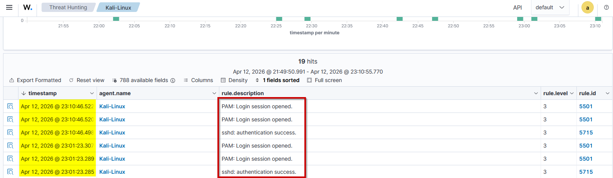

---

## 🔥 Privilege Escalation

### Command:
sudo su

### Detection:
- Rule ID: 5402, 5405

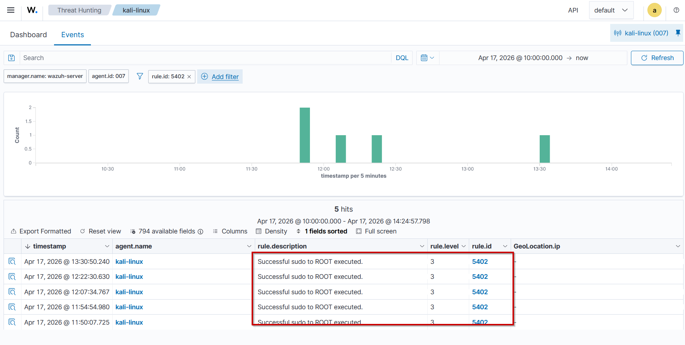

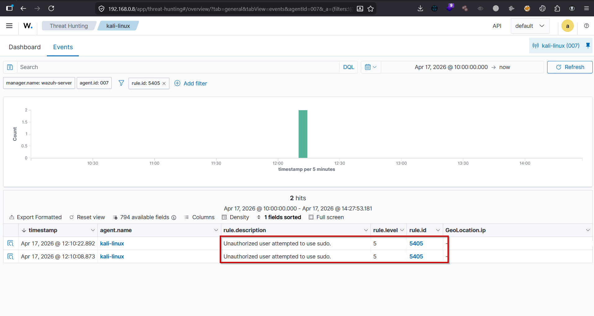

---

## 👤 Persistence (User Creation)

### Command:
sudo useradd hacker
sudo passwd hacker

### Detection:
- Rule ID: 5902,5555

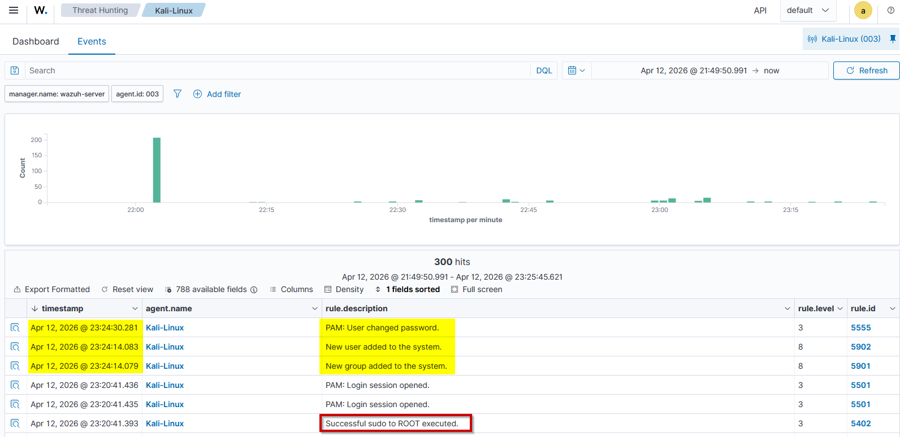

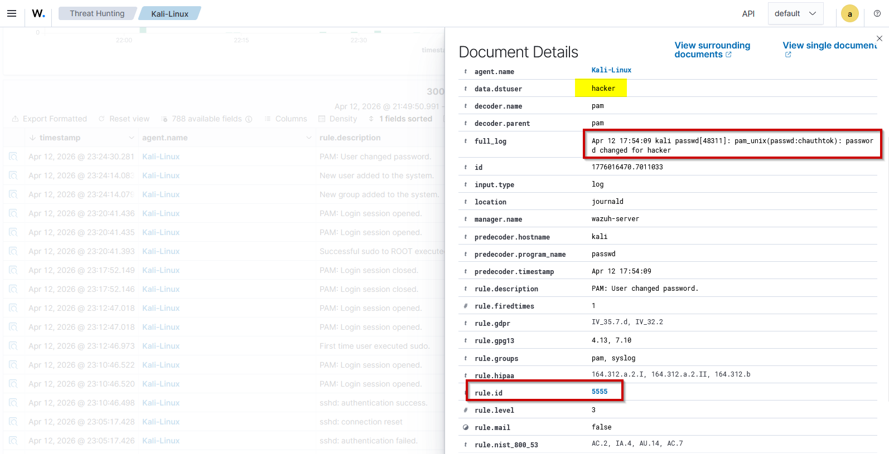

---

## 🔥 File Integrity Monitoring (FIM) was used to detect persistence (authorized_keys modification) and defense evasion (log tampering).

## 🔑 SSH Backdoor

### Command:
echo "key" >> ~/.ssh/authorized_keys

### Detection:
- FIM (Rule ID: 550 )

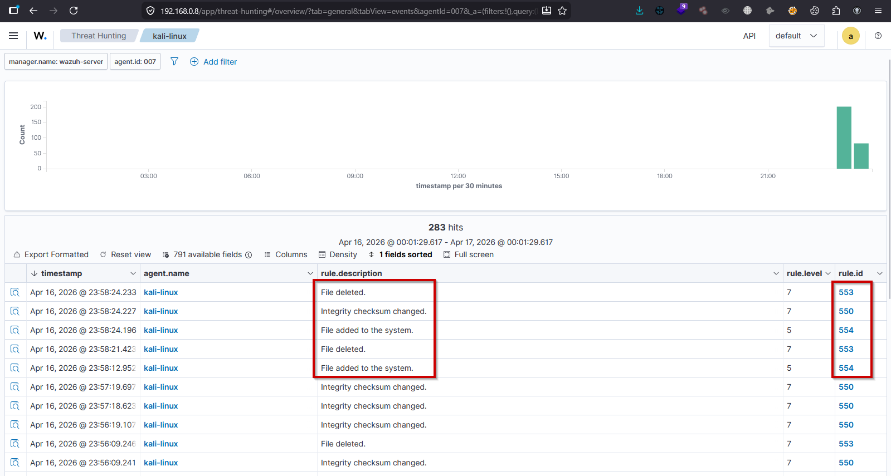

---

## 🧹 Log Tampering

### Command:
truncate -s 0 /var/log/auth.log

### Detection:
- FIM alert triggered
- MITRE: T1070

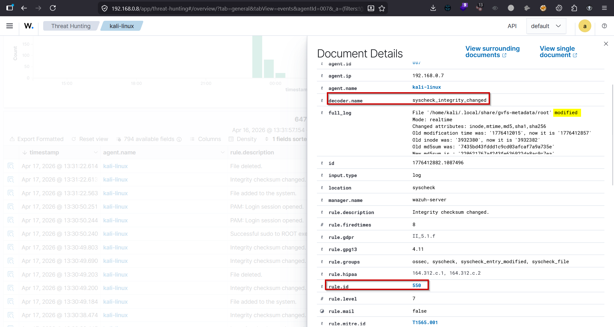

---

### 🌐 Network Activity Detection
- Detected new listening ports
- Possible tunneling/backdoor activity observed

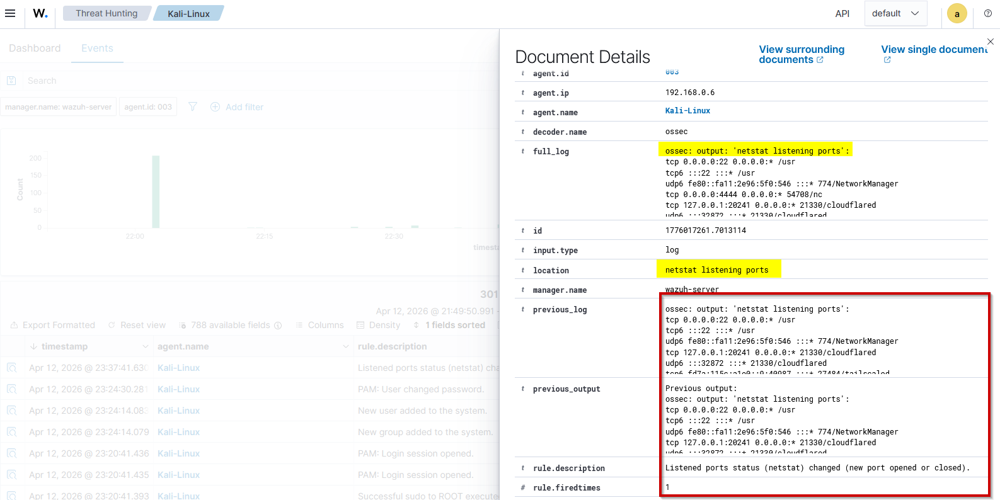

---

## 📂 File Monitoring (FIM)

### Commands:
echo "test" > file.txt
rm file.txt

### Detection:
- Rule ID: 554 (created)
- Rule ID: 553 (deleted)

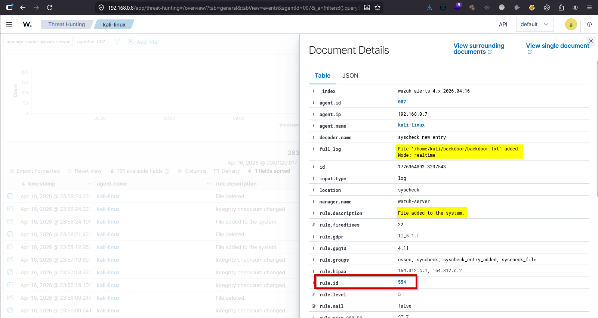

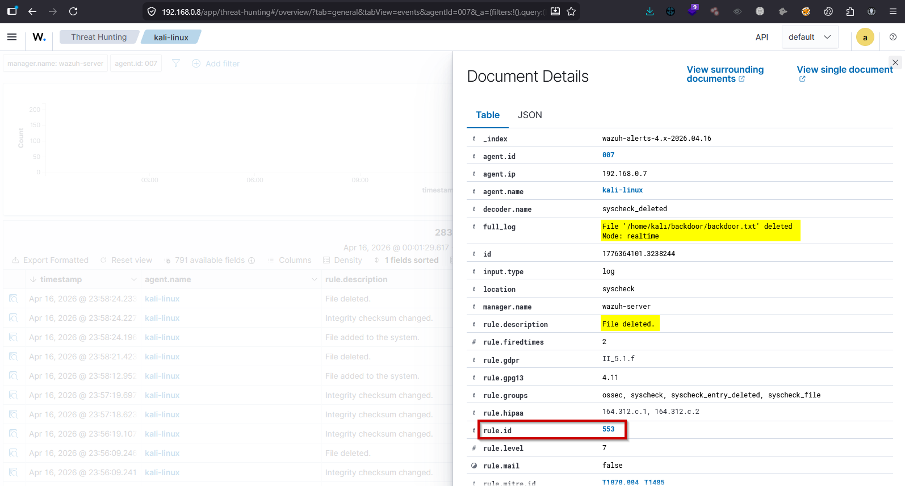
